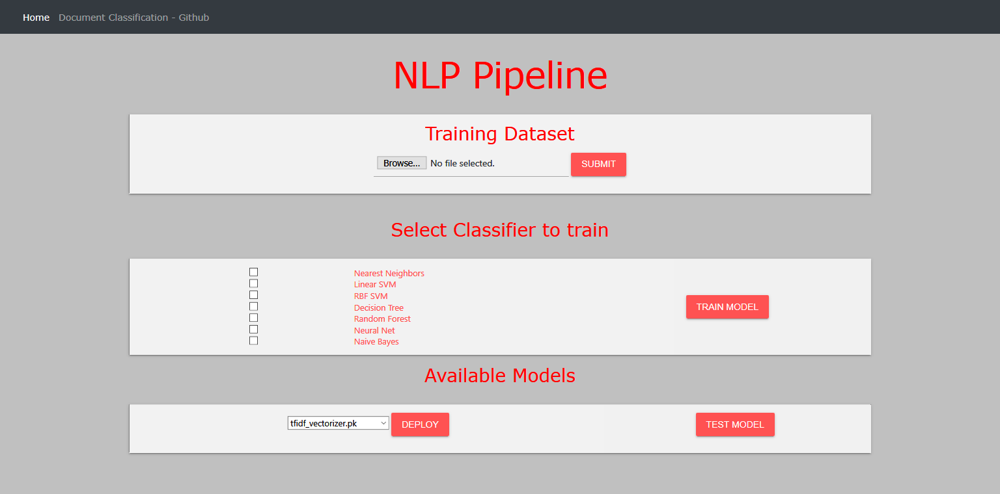

# document_classification
This project is an attempt to provide a generic pipeline for document classification using various machine learning models 
 that can be hosted in any cloud service without  difficulty. This repository is connected to the heroku cloud 
 and is hosted as a pipe app at https://nlp-pipe.herokuapp.com/. 
 
 This project features the following: 
 - Online training of models using custom training data provided by the user. 
 - Adjust the  training and result validation split. The default  split is 80-20. 
 - Display the results and get the pickle file for the trained model. 
 - Use model spike file for prediction.

## Features 
 - The following features below are delivered as a bottle application and can be hosted on any cloud platform. 
 - This repository is directly connected to the Heroku platform, so any new commit to the repository will cause changes to be  reflected in the 
 Heroku app in real time  at https://nlp-pipe.herokuapp.com/. 
 - At first, the heroku instance takes time to start, when it can be used, and the interface is shown as 
  
 1. Load the user input as two. -column csv file, viz document and class 
 2. Feature Engineering 
 - [X] Removal of English stop words ie. sklearn stop words 
 - [X] derivation and lemmatization 
 - [X] TF-IDF 
 - [] Word2
3.  Building a model with default parameters 
 - Naive-Bayes 
 - SVM 
 - Random Forest 
 - Nearest Neighbors 
 - Linear SVM 
 - Decision Tree 
 - Random Forest 
 - Neural Network 
 Training of all models (even single model sometimes) takes more than 30 seconds for large dataset.The free version of Heroku instance 
 does not support it. If you really want to test the app, you can host it on AWS or send me an email.
 4. Test the results of the models by entering text. 
 5. Implement each model as an API.

##Running on AWS
 1. Install all  packages with `pip3 install -r requirements.txt` 
 2. `sudo python3 -m nltk.downloader -d /usr/share/nltk_data` 
   corpora 
 3. Then load all and stop words 
 4. Run the flask application with `sudo python3 -m flask run --host=0.0.0.0 --port=80`. 
 5. The application can be opened with the public IP address in the aws console.
 

 
### References:
 - https://pyliaorachel.github.io/blog/tech/system/2017/07/07/flask-app-with-gunicorn-on-nginx-server-upon-aws-ec2-linux.html
 - http://nginx.org/en/docs/beginners_guide.html#conf_structure
 - https://www.digitalocean.com/community/tutorials/how-to-serve-flask-applications-with-gunicorn-and-nginx-on-ubuntu-14-04
